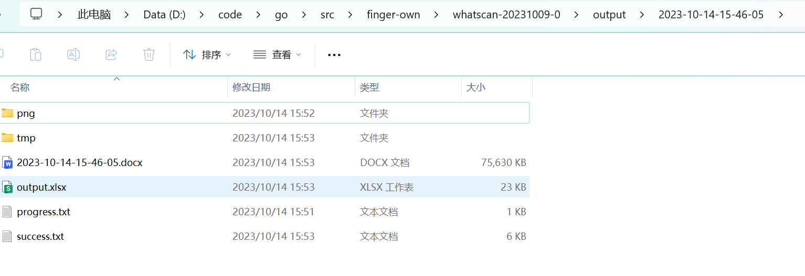
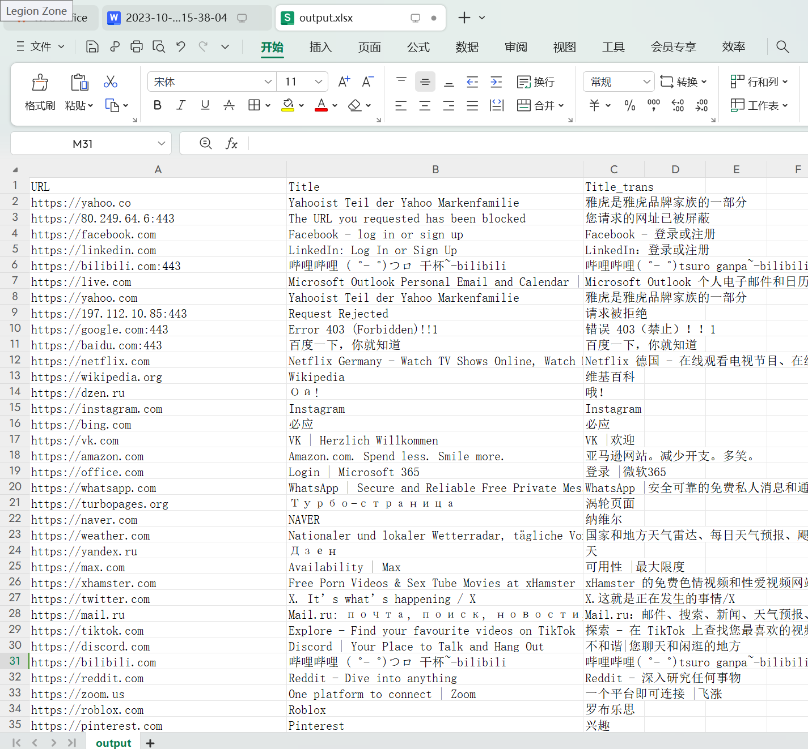
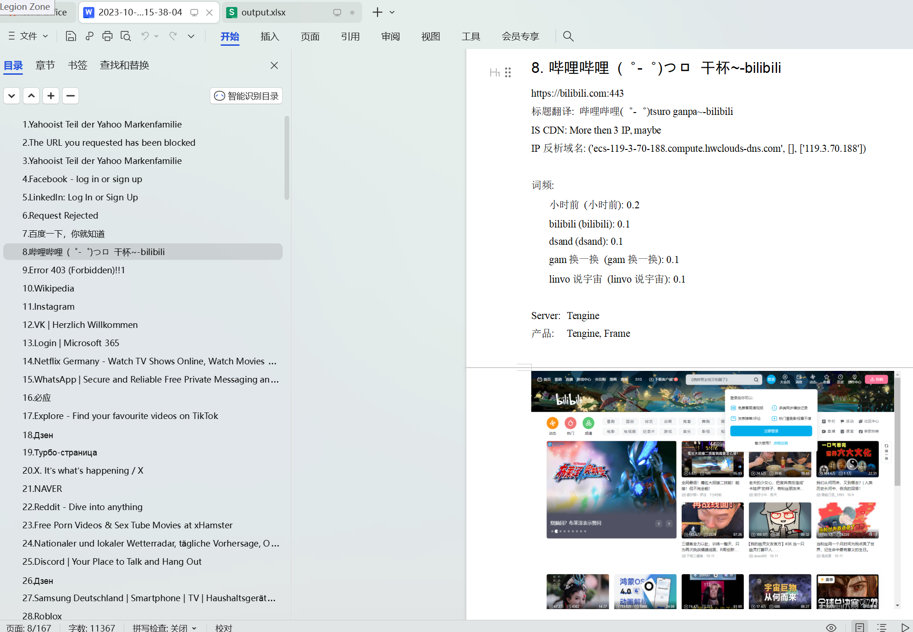
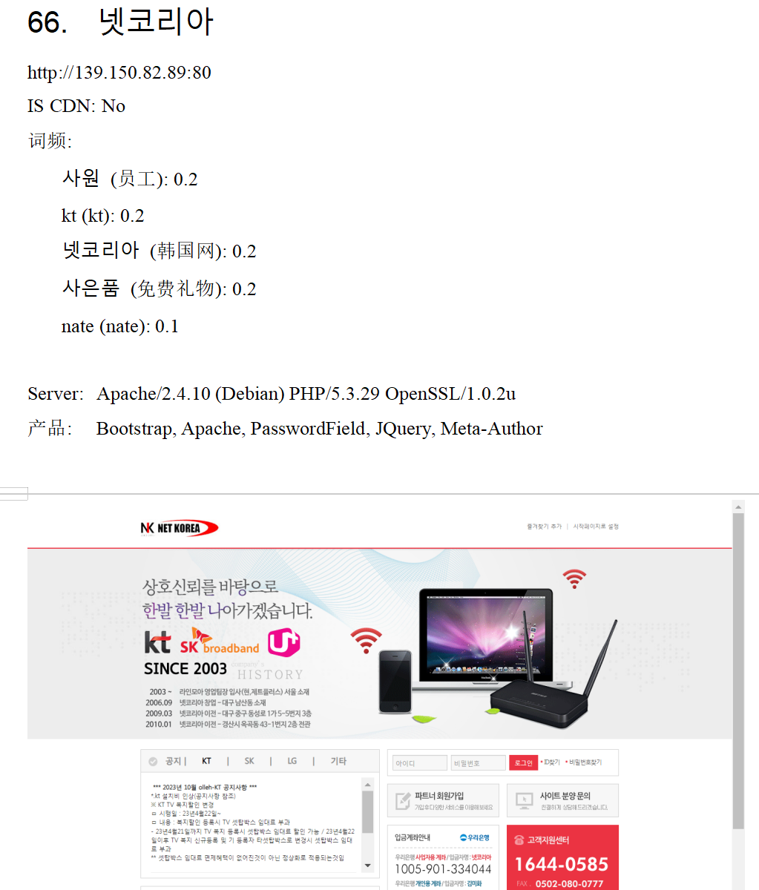
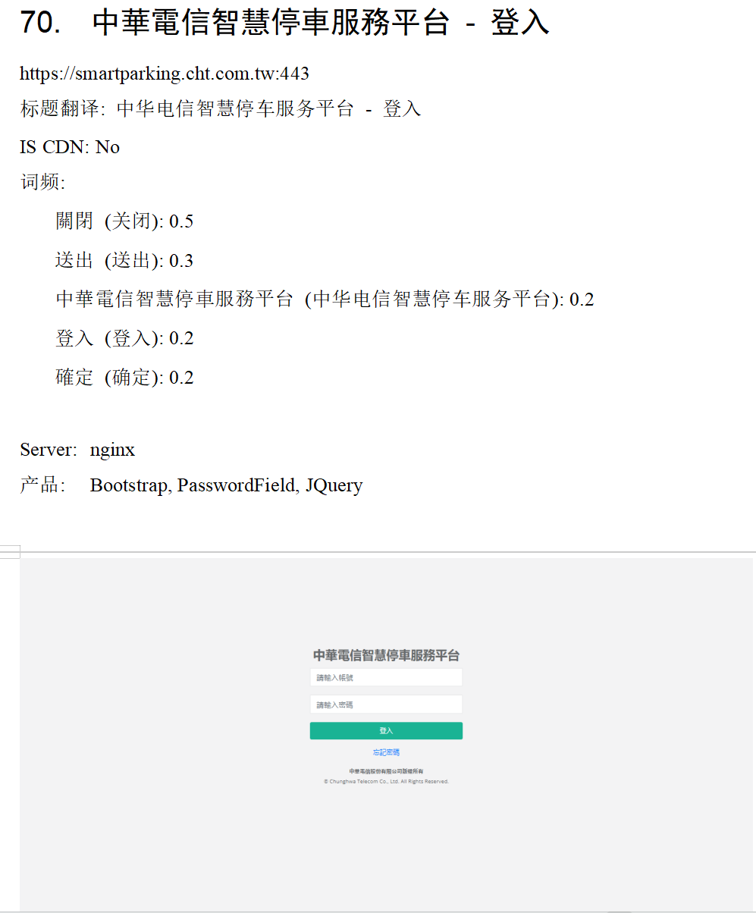
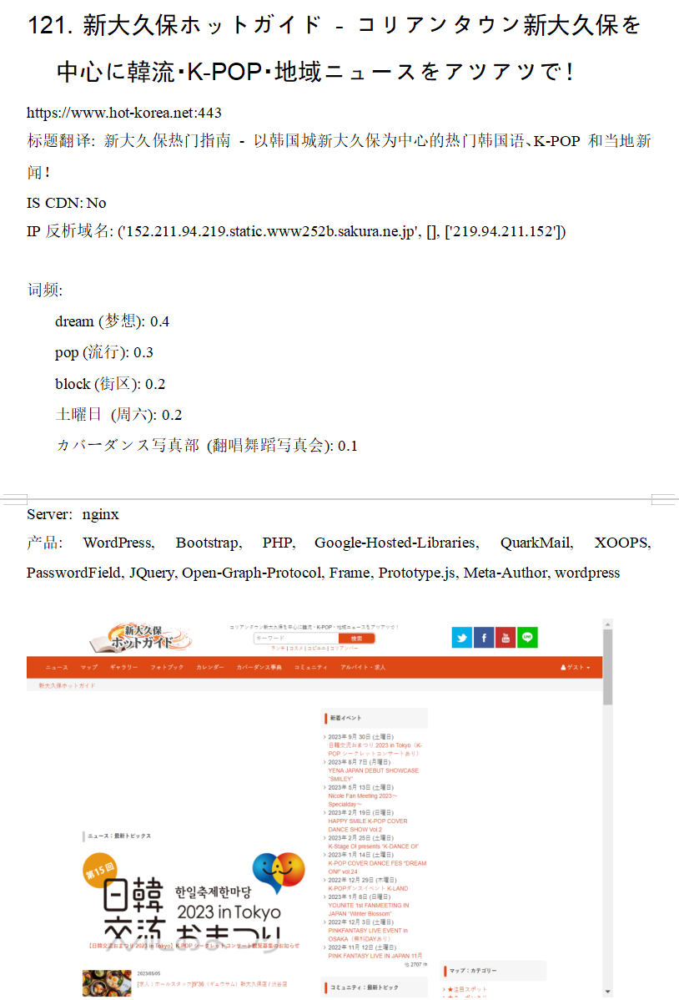
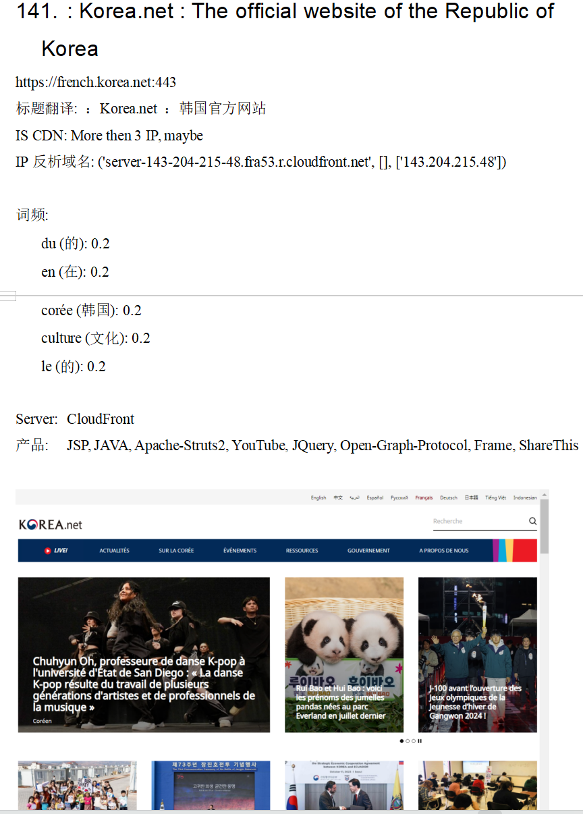
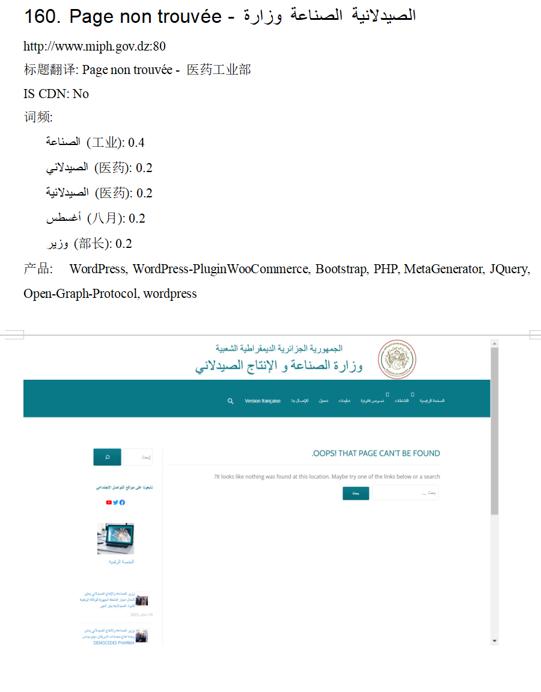

# 简介

在信息收集的过程往往遇到以下问题：

1. 网络空间搜素引擎和诸多扫描工具如kscan、fscan等，所探测到的web资产，存在大量状态码为302、200的页面没有标题，也识别不出是什么东西，有一些页面是真的没有标题，但更多的页面其实是由于扫描器没有跟随跳转，无法得到最终页面，所以标题是空。无法得到最终页面的原因，要么是没有跟随状态码，要么是状态码为200但在页面js中进行了跳转，由于扫描器无法渲染js因此无法跟随。基于这样的原因，导致很多资产搞不清楚它是什么，更搞不清楚它是什么性质。
2. 由于任务目标的语言问题，往往从页面标题看不出其性质，哪怕手动打开页面也需要翻译，判断一个网站是否归属于目标比较困难。
3. 得到了大量目标域名和ip，想要探测目标c段找找还有没有目标资产，但哪怕探测到了web资产也面临上述问题1和问题2，整体来说是个体力活。


为解决以上问题，笔者开发了whatscan，可以对批量URL进行web扫描、截屏、标题翻译、高频词识别、web组件识别，输出为excel和word文档，翻遍整理和撰写报告。

其中，web组件识别使用了kscan的2.4w条web指纹，目录下的kscan.dll是基于kscan源码修改添加了调用本地指纹识别的go方法（使用了cgo），编译为dll，然后在python中调用dll里的导出函数直接进行指纹识别，不进行多余的二次探测，kscan的指纹在目录下的static\fingerprint.txt，可自定修改和添加新指纹，这样就具备了可扩展能力（感谢kscan）。

整体来说，whatscan的功能如下：

- web资产识别（CMS/应用组件/容器/编程语言等信息）
- 支持对web站点截屏
- 支持浏览器模拟，解决普通爬虫对js无法渲染的短板，可识别js跳转得到真实页面和标题
- 支持标题翻译（调用google翻译，因此需要翻墙）
- 支持从页面提取高频词并翻译
- 支持IP反析域名
- 支持导出word文档和excel
- 适合从核心资产提取了c段后，对多个c段内的资产进行探测和梳理，看看存在什么东西，有没有需要关注的资产

# 帮助

本项目使用selenium借用chromedriver进行无头浏览器的访问。因此需要安装chrome浏览器，并访问https://chromedriver.chromium.org/downloads**下载符合当前chrome版本的chromedriver.exe放置到项目路径下**。若chromedriver.exe版本不符合，可能一运行就会报满屏异常，看起来在运行，其实没有用，还是要换正确的版本。


运行前，修改当前目录下的config.ini，根据自己的需要做配置：

```
[set]
#浏览器线程，建议不超过50，除非cpu和网络好
browser_thread=20
#输入文件名。文件内容每行一个url，放在input文件夹下
input_file=input.txt
#从输入文件的哪一行开始探测
read_index=1

#探测时是否使用socks5代理
use_proxy=1
#访问谷歌翻译api是否需要使用代理
translate_using_proxy=1

#是否需要谷歌翻译来翻译标题和高频词
need_tanslate=1
#是否需要开启高频词分析
need_word_freq=1

#谷歌翻译api请求的超时时间
google_tran_api_timeout=30
#页面加载最长时间
set_page_load_timeout=30

#代理服务器IP
proxy_server=127.0.0.1
#代理服务器端口
proxy_port=10809


q_input_length=50
q_output_length=50
```

运行时先安装依赖：pip install -r requirements.txt

然后可直接执行： python  whatscan.py 

输出的word和excel保存在 output/<时间戳>下，如下图。



程序运行时，请勿打开xlsx或tmp下的word文件，以免最后合并文档时无法读取被office占用的文档。

若在程序运行时ctrl+c结束了程序，可能造成chrome进程意外留存，可执行项目目录下的kill-chrome.bat关闭本机所有chrome和chromedriver进程。


# 输出展示

## excel



## word

其中，“产品”对应的信息就是kscan的指纹识别结果。
















